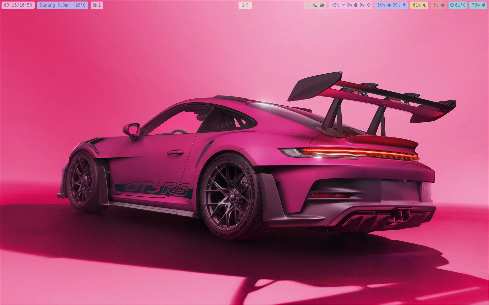
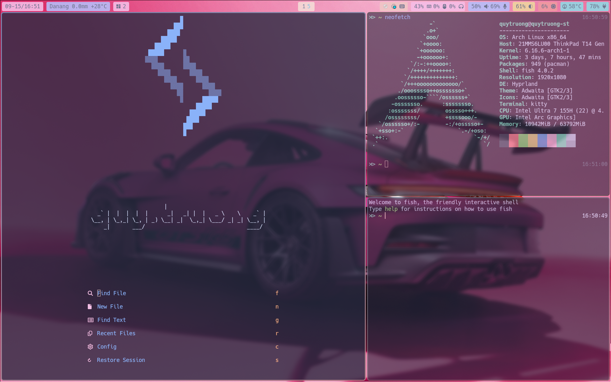

# Hyprland Dotfiles Configuration

A comprehensive Hyprland desktop environment configuration featuring a modern, customizable Wayland compositor setup with carefully crafted theming and productivity-focused workflows.

## Overview

This repository contains my personal dotfiles for a complete Hyprland-based desktop environment. The configuration emphasizes performance, aesthetics, and workflow efficiency with a focus on keyboard-driven interaction patterns.

## Screenshots





## Features

- **🏗️ Hyprland**: Modern Wayland compositor with advanced window management
- **🎨 Catppuccin Theme**: Consistent Macchiato colorscheme across all applications
- **🚀 Performance Optimized**: Efficient animations and resource usage
- **⌨️ Keyboard-Centric**: Comprehensive keybinding system with vim-like navigation
- **🎵 Media Integration**: MPV background videos and MPRIS media controls
- **🔧 Modular Configuration**: Well-organized, easily customizable setup
- **📱 Multi-Monitor Support**: Intelligent workspace distribution across displays
- **🔒 Security**: Integrated screen locking with biometric support

## Core Components

### Window Manager & Desktop

- **Hyprland**: Main compositor with custom animations and layouts
- **Waybar**: Feature-rich status bar with system monitoring
- **Rofi**: Application launcher and system interaction
- **Hyprpaper**: Wallpaper daemon
- **Hypridle/Hyprlock**: Idle management and screen locking

### Applications & Tools

- **Kitty**: GPU-accelerated terminal emulator
- **Neovim**: Advanced text editor with LazyVim configuration
- **Yazi**: Modern file manager with vim-like navigation
- **Fish**: User-friendly shell with custom functions
- **Tmux**: Terminal multiplexer for session management

### System Integration

- **Dunst**: Notification daemon
- **ClipHist**: Clipboard manager with Wayland support
- **Brightness/Audio Controls**: Integrated system controls
- **Power Management**: Automatic suspend and power profile switching

## Prerequisites

### System Requirements

- **Operating System**: Arch Linux (or Arch-based distribution)
- **GPU**: Modern GPU with OpenGL support (NVIDIA users see special notes)
- **Display Server**: Wayland support required

### Core Dependencies

#### Hyprland Ecosystem

```bash
# Main compositor and tools
hyprland               # Wayland compositor
hyprpaper             # Wallpaper daemon
hypridle              # Idle daemon
hyprlock              # Screen locker
hyprshot              # Screenshot utility
```

#### Essential System Components

```bash
# Window management and desktop
waybar                # Status bar
rofi                  # Application launcher
dunst                 # Notification daemon
kitty                 # Terminal emulator

# Audio and media
pipewire              # Audio server
pipewire-pulse        # PulseAudio compatibility
pavucontrol           # Audio control GUI
playerctl             # Media player control
swayosd               # On-screen display for volume/brightness

# System utilities
brightnessctl         # Backlight control
cliphist              # Clipboard manager
wl-clipboard          # Wayland clipboard utilities
polkit-gnome          # Authentication agent
```

#### Application Suite

```bash
# File management and productivity
thunar                # File manager
yazi                  # Terminal file manager
tmux                  # Terminal multiplexer

# Networking and connectivity
fcitx5                # Input method framework
google-chrome         # Web browser (or browser of choice)

# Development tools
neovim                # Text editor
fish                  # Shell
```

#### Fonts and Theming

```bash
# Essential fonts
ttf-jetbrains-mono-nerd   # Main UI font
ttf-hack-nerd            # Alternative nerd font
papirus-icon-theme       # Icon theme

# Theme components
catppuccin-gtk-theme     # GTK theme (AUR)
```

### Optional Dependencies

```bash
# Media and entertainment
mpv                   # Video player (for background videos)
sunshine              # Game streaming (commented in config)

# Development utilities
ydotool               # Programmatic input (for mouse control submap)
```

### NVIDIA Users

For NVIDIA GPU users, additional configuration is required:

1. Install NVIDIA drivers:

```bash
nvidia nvidia-utils nvidia-settings
```

2. Set environment variables in `/etc/environment`:

```bash
LIBVA_DRIVER_NAME=nvidia
__GL_VRR_ALLOWED=0
__GLX_VENDOR_LIBRARY_NAME=nvidia
```

3. Enable DRM kernel mode setting in `/etc/default/grub`:

```bash
GRUB_CMDLINE_LINUX_DEFAULT="... nvidia-drm.modeset=1"
```

## Installation

### 1. Install Dependencies

```bash
# Install from official repositories
sudo pacman -S hyprland waybar rofi dunst kitty pipewire pipewire-pulse \
               pavucontrol playerctl brightnessctl wl-clipboard polkit-gnome \
               thunar tmux neovim fish ttf-jetbrains-mono-nerd papirus-icon-theme

# Install AUR packages (using yay or paru)
yay -S hyprpaper hypridle hyprlock hyprshot cliphist swayosd catppuccin-gtk-theme-macchiato
```

### 2. Clone and Deploy Configuration

```bash
# Clone the repository
git clone <repository-url> ~/.config/mydotfiles
cd ~/.config/mydotfiles

# Create symbolic links (adjust paths as needed)
ln -sf ~/.config/mydotfiles/hypr ~/.config/
ln -sf ~/.config/mydotfiles/waybar ~/.config/
ln -sf ~/.config/mydotfiles/rofi ~/.config/
ln -sf ~/.config/mydotfiles/kitty ~/.config/
ln -sf ~/.config/mydotfiles/nvim ~/.config/
ln -sf ~/.config/mydotfiles/yazi ~/.config/
ln -sf ~/.config/mydotfiles/fish ~/.config/
ln -sf ~/.config/mydotfiles/tmux ~/.config/
```

### 3. Configure System Services

```bash
# Enable required user services
systemctl --user enable pipewire pipewire-pulse
systemctl --user start pipewire pipewire-pulse

# Configure fish as default shell (optional)
chsh -s /usr/bin/fish
```

### 4. Set Up Wallpapers

```bash
# Create wallpaper directory
mkdir -p ~/Wallpapers

# Add your wallpapers and update hyprpaper.conf paths accordingly
```

## Configuration Structure

```
hypr/
├── hyprland.conf         # Main Hyprland configuration
├── windowrule.conf       # Window rules and behavior
├── macchiato.conf        # Catppuccin color definitions
├── hyprpaper.conf        # Wallpaper configuration
├── hypridle.conf         # Idle management
├── hyprlock.conf         # Lock screen configuration
└── scripts/              # Helper scripts

waybar/
├── config                # Waybar configuration
├── style.css            # Waybar styling
└── script/              # Custom waybar modules

rofi/
├── config.rasi          # Rofi configuration
└── */                   # Custom rofi scripts and themes
```

## Key Features & Keybindings

### Core Navigation

- `Super + Return`: Open terminal (Kitty)
- `Super + B`: Launch browser (Chrome)
- `Super + E`: File manager (Thunar)
- `Super + W`: Toggle Waybar

### Window Management

- `Super + hjkl`: Focus windows (vim-style)
- `Super + Shift + hjkl`: Move windows
- `Super + Ctrl + hjkl`: Resize windows
- `Super + F`: Fullscreen toggle
- `Super + Space`: Toggle floating mode

### Application Launcher

- `Super + Shift + P`: Application launcher (Rofi)
- `Super + Shift + R`: Run command
- `Super + Shift + O`: File browser
- `Super + V`: Clipboard history

### Workspaces

- `Super + 1-9`: Switch to workspace
- `Super + Shift + 1-9`: Move window to workspace
- `Super + Tab/Shift+Tab`: Cycle workspaces
- `Super + N`: Move to special workspace

### System Controls

- `Super + Ctrl + Q`: Lock screen
- Volume/Brightness keys: Hardware key support
- `Super + Shift + S`: Screenshot region
- `Print`: Screenshot current output

### Advanced Features

- `Super + S`: Mouse control mode (keyboard mouse navigation)
- `Super + Backspace`: Show keybindings help
- `Alt + Tab`: Window cycling with thumbnails

## Customization

### Themes

The configuration uses Catppuccin Macchiato theme. To change themes:

1. Update `hypr/macchiato.conf` with new color definitions
2. Modify `waybar/style.css` for status bar colors
3. Adjust `rofi` themes accordingly

### Monitors

Update monitor configuration in `hypr/hyprland.conf`:

```bash
monitor=DP-3,1920x1080@60,auto,1
workspace=1,default:true,monitor:eDP-1
```

### Wallpapers

Configure wallpapers in `hypr/hyprpaper.conf`:

```bash
preload = ~/Wallpapers/your-wallpaper.jpg
wallpaper = ,~/Wallpapers/your-wallpaper.jpg
```

## Troubleshooting

### Common Issues

1. **Black screen on startup**: Check GPU drivers and Hyprland installation
2. **No audio**: Ensure PipeWire services are running
3. **Applications not launching**: Verify all dependencies are installed
4. **NVIDIA issues**: Follow NVIDIA-specific setup steps above

### Logs and Debugging

```bash
# Check Hyprland logs
journalctl --user -u hyprland

# Check Waybar logs
journalctl --user -u waybar

# Test Hyprland configuration
hyprctl reload
```

## Contributing

Feel free to submit issues, feature requests, or pull requests. When contributing:

1. Test changes thoroughly
2. Update documentation as needed
3. Follow existing code style and organization
4. Consider backward compatibility

## License

This configuration is available under the MIT License. See individual component licenses for their respective terms.

## Acknowledgments

- [Hyprland](https://hyprland.org/) - The amazing Wayland compositor
- [Catppuccin](https://catppuccin.com/) - Beautiful pastel theme
- [LazyVim](https://lazyvim.github.io/) - Neovim configuration framework
- The open-source community for countless tools and inspiration

